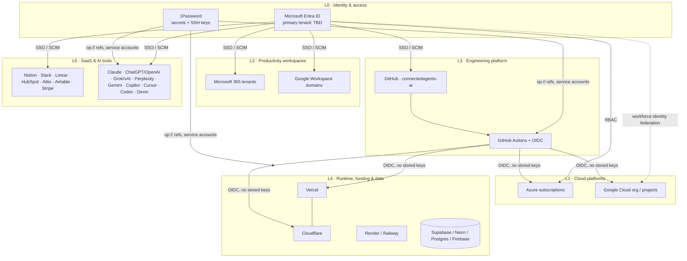

# Cloud architecture: top-down

Read it top to bottom. Each layer depends only on the layers above it. Every service appears **once** in the register (§3),
with a status and a decision. Status is **evidence-based**: *Unknown* means not yet verified. Run `ops/cloud-inventory/inventory_cloud.sh`
and the connector inventories to fill it in.

## 1. Target topology

**Principles**
1. **One identity provider.** Every human login and app assignment flows from Entra ID: SSO with SAML/OIDC, and SCIM provisioning where the plan supports it.
2. **One secret store.** 1Password holds every secret. CI uses **OIDC federation** into Azure, GCP and Vercel instead of long-lived keys.
3. **One tenant or org per layer, where possible.** Extra tenants are migrated in or retired, unless there's a legal or entity reason to keep them separate. If so, record the reason.
4. **Every kept service is wired in:** SSO from Entra, secrets from 1Password, config in `agent-central-config`, owner and cost recorded in the register, logs and alerts on.

## 2. Open architecture decisions (need owner answers)
| # | Decision | Options / evidence |
|---|---|---|
| D1 | **Top identity provider: Entra ID or Okta?** | `archive-dedup-playbook/docs/security/identity-and-secrets.md` makes **Okta** the workforce identity provider and uses Entra only for app registrations. The new direction is Entra at the top. If so, retire Okta or federate it under Entra, and update that doc |
| D2 | **Primary Entra / M365 tenant** | Seen: `onewishlabs.com` (connected here: Robert Bailey, Founder) and `netzerolending.io` (used for Graph in the playbook). Others? Pick one primary, and use cross-tenant sync or B2B for the rest, or migrate |
| D3 | **Google Workspace: keep as the document home, or identity-federate it only?** | `powerconnection.com` owns the active Drive and Notion identity. Option: keep Workspace for Drive/Docs with Entra as its identity provider (SAML) |
| D4 | **Primary cloud for backends: GCP, Azure, or both?** | June audit: production backends on **GCP**, frontends on **Vercel**. No Azure workloads seen yet |
| D5 | **Consumer accounts** (outlook.com Copilot, iCloud, personal Gmail) | These can't join SSO. Export into the canonical stores, then retire them or keep for personal use only |
| D6 | **Which entity owns which tenant** | Power Connection / OneWish Labs / NetZero Lending / Connected Energy, …: needed for billing, legal separation and the taxonomy |

## 3. Service register
Status: **Active** / **Inactive** / **Unknown** · Decision: **Keep + wire** / **Migrate → X** / **Retire** / **Decide**

| Layer | Service | Account / tenant | Evidence | Status | Decision | Wire-in tasks |
|---|---|---|---|---|---|---|
| L0 | Microsoft Entra ID | onewishlabs.com | M365 connector sign-in | Active | Keep + wire (primary? D2) | Conditional Access + MFA, admin roles review, enterprise apps for every L2–L5 service |
| L0 | Microsoft Entra ID | netzerolending.io | Graph app in archive-dedup-playbook | Unknown | Decide (D2) | if kept: cross-tenant sync; else migrate users, mail and files |
| L0 | Okta | ? | identity-and-secrets.md | Unknown | Decide (D1) | if retired: move app assignments to Entra |
| L0 | 1Password | powerconnection.ai account | agent-central-config | Active | Keep + wire | Entra SSO (Unlock with SSO), vault model, service accounts for CI, **replace the keys in the committed .env** |
| L1 | Google Cloud | org/projects ? | June audit: prod backends on GCP. `antigravity-gcp-bootstrap` repo | Active | Keep + wire (D4) | inventory projects and billing, Entra workforce identity federation, budgets, staging project, rotate service-account keys → GitHub OIDC |
| L1 | Azure | subscriptions ? | Entra present, no workloads seen | Unknown | Decide (D4) | inventory. If empty, keep only for Entra and M365 |
| L2 | Microsoft 365 | onewishlabs.com | connector | Active | Keep + wire | Copilot export (ai-library), SharePoint/OneDrive into taxonomy |
| L2 | Microsoft 365 | netzerolending.io | playbook | Unknown | Decide (D2) | Purview export → migrate or keep |
| L2 | Google Workspace | powerconnection.com | Drive + Notion owner | Active | Keep + wire (D3) | SAML to Entra, Drive into taxonomy, Takeout for Gemini/NotebookLM |
| L2 | Consumer: outlook.com, iCloud, Gmail | personal | user | Active | Decide (D5) | export → canonical stores |
| L3 | GitHub | connectedagents-ai | this repo | Active | Keep + wire | org SSO with Entra (needs GitHub Enterprise Cloud for SAML; otherwise Entra-managed 2FA + membership reviews), rulesets, push protection |
| L3 | GitHub | Connected-Energy-AI | 82 repos | Active | Migrate → connectedagents-ai | `ops/github-consolidation` |
| L4 | Vercel | ? | June audit: powerconnection.ai frontend | Active | Keep + wire | SSO, GitHub OIDC, preview envs, owners per project |
| L4 | Cloudflare | ? | `cloudflare-curated`, playbook agent (wrangler) | Unknown | Keep + wire? | DNS registry for all domains, Access (Zero Trust) with Entra identity provider |
| L4 | Render / Railway | ? | `render-workflows`, `photos-on-render`, `railway-skills` | Unknown | Decide | consolidate onto one of Vercel / GCP / Render |
| L4 | Supabase / Neon / Postgres / Firebase | ? | .env keys, `my-vercel-neon-app-*` | Unknown | Decide | one primary database platform per product |
| L4 | Databricks | ? | `agent-central-config/mcp-configs/databricks-mcp.json` | Unknown | Decide | |
| L4 | Hugging Face Spaces | ? | `hf-spaces` repo | Unknown | Decide | |
| L5 | Notion | powerconnection.com | connector | Active | Keep + wire? (notes decision) | SSO/SCIM (plan-dependent), teamspaces by domain |
| L5 | Slack, Linear, HubSpot, Attio, Airtable, Stripe | ? | .env keys, plugin repos | Unknown | Decide each | SSO where available, owner, rotate keys |
| L5 | AI tools (Claude, ChatGPT/OpenAI, Grok/xAI, Perplexity, Gemini, Copilot, Cursor, Codex, Devin, OpenRouter, Groq, DeepSeek, Mistral, Blackbox) | multiple | .env keys, user | Mixed | Keep 3–5 core. Retire the rest | SSO/team plans on core tools, exports → ai-library, rotate and revoke API keys |

## 4. Wire-in checklist (for every service marked Keep)
- ☐ Owner and entity recorded · ☐ Entra SSO (or documented why not) · ☐ MFA enforced · ☐ Admins ≤ 2
- ☐ Secrets only in 1Password (`op://`) · ☐ CI uses OIDC · ☐ Config template (no secrets) in `agent-central-config`
- ☐ Billing owner + budget alert · ☐ Logs/alerts on · ☐ Named per `docs/NAMING-CONVENTIONS.md` · ☐ Tagged with `entity`, `domain`, `status`

## 5. Migration and retirement playbook
1. **Inventory** (read-only): `ops/cloud-inventory/inventory_cloud.sh` + connectors → fill in §3.
2. **Decide** D1–D6 → mark every row.
3. **Identity first:** primary Entra tenant, MFA and Conditional Access, then add SSO app by app (L2 → L5).
4. **Migrate data** into the kept tenant or workspace (Purview/Graph for M365, Takeout or Drive transfer for Google, GitHub transfer).
5. **Retire:** revoke keys, remove SSO apps, cancel billing, keep a read-only export in the archive. Record the retirement date in the register.
